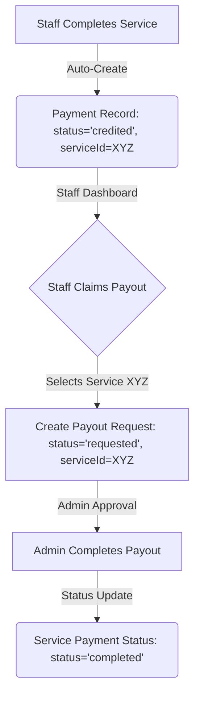

# Efficient Service-Based Payment System Proposal

This document outlines a proposal to optimize the virtual payment system, making it more user-friendly, database-efficient, and structurally aligned with paying staff per completed service (`serviceId`).

---

## 1. Core Architectural Strategy

To pay staff based on specific completed services and make the system faster, we propose shifting from a **general balance withdrawal model** to a **job-payout model** where each completed service acts as a claimable payout unit.



---

## 2. Database & Server-Side Optimization

### Current Bottleneck
Currently, `getStaffBalance` runs two SQL aggregations (`SUM` queries) over the entire `payments` table every time a balance check is needed. As history grows, this causes database slowdowns.

### Proposed Solutions

#### A. Add Payment Status to the `services` Table
Add a `paymentStatus` column directly to the `services` table. This allows fast lookup of which services are paid, pending payment, or unpaid.
```typescript
// In src/db/schema.ts
export const servicePaymentStatusEnum = pgEnum("servicePaymentStatus", [
  "unpaid",
  "requested",
  "processing",
  "paid"
]);

// Update services table:
paymentStatus: servicePaymentStatusEnum().default("unpaid").notNull()
```

#### B. Cache Balances on the `staffs` Table (Atomic Updates)
Add a cached balance field on the `staffs` table to avoid querying the `payments` table during routine dashboard renders.
*   `virtualBalance`: Incremented atomically when a service is completed/credited.
*   `virtualBalance`: Decremented atomically when a payout request is approved/completed.
*   **Indices**: Add a composite index on `(staffId, status, serviceId)` in the `payments` table.

---

## 3. UI/UX Optimization (Easier Payment Process)

### A. Staff Perspective: "Claim by Completed Service"
Instead of forcing staff to manually calculate and type a withdrawal amount:
1.  **Completed Jobs List**: Display a dashboard list of all completed services where `paymentStatus = 'unpaid'`.
2.  **Bulk Claiming**: Allow checkboxes next to completed services. Staff can check the services they want to cash out and click **"Claim Selected"**.
3.  **Automatic Form Filling**: The system auto-calculates the sum of checked services, attaches their `serviceId`s, and submits the payout request in one click.

### B. Admin Perspective: "Service-Linked Approvals"
1.  **Direct Links**: When viewing a payout request, show the associated completed service details (e.g., customer, issue resolved, rating) directly in the request row.
2.  **One-Click Verify & Approve**: Admin can verify the work quality and release/approve the payment in a single action, automatically updating both the payment request and the service payment status.

---

## 4. Summary of Benefits

| Perspective | Current System | Proposed System |
| :--- | :--- | :--- |
| **Server / DB** | Dynamic sum aggregations on page loads (slows down with history size) | Direct column lookups, caching, and indexed queries (constant time $O(1)$) |
| **Staff Experience** | Manual calculations; doesn't know which job pays what | Simple checklist of completed jobs; click to withdraw |
| **Admin Experience** | Manual reconciliation of payouts to service history | Direct linkage to `serviceId`; simple verify-and-approve flow |
