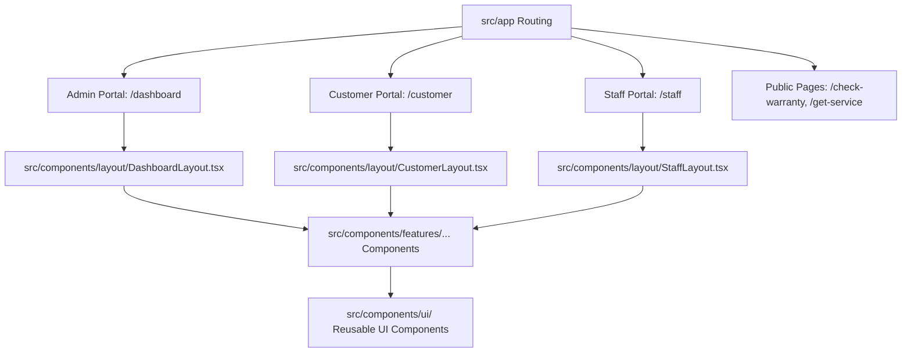

# UI Anatomy: SE Electronics Management System

This document maps out the User Interface (UI) architecture, component structure, page routing relationships, and guidelines for extending/modifying the frontend of the **SE Electronics Management System**.

---

## 1. Architectural Overview

The application is built on **Next.js (App Router)** with **TypeScript** and **Tailwind CSS**. It divides the interface into three main user interfaces:
1. **Admin Portal**: Main dashboard for business administration.
2. **Customer Portal**: Portal for clients to track jobs, request services, and view warranties.
3. **Staff / Technician Portal**: Workspace for field technicians and electricians to receive tasks and log progress.

---

## 2. Directory Breakdown

### 📂 `src/components/layout`
Contains shell frameworks defining headers, sidebar navigation, bottom navigation bars, and overall page structures.
*   **[DashboardLayout.tsx](file:///c:/Users/talha/Programming/seelectronics_management_system/src/components/layout/DashboardLayout.tsx)**: The main layout for administrators. Features a sticky sidebar with links, SMS balance checking, collapsible drawer for mobile view, and custom client-side progress bars.
*   **[CustomerLayout.tsx](file:///c:/Users/talha/Programming/seelectronics_management_system/src/components/layout/CustomerLayout.tsx)**: Client-side layout. Incorporates client headers, bottom navigation bars, and notice banners fetching periodic system notifications.
*   **[StaffLayout.tsx](file:///c:/Users/talha/Programming/seelectronics_management_system/src/components/layout/StaffLayout.tsx)**: Handles mobile-responsive navigation headers and bottom bars specifically designed for staff.
*   **[Toolbar.tsx](file:///c:/Users/talha/Programming/seelectronics_management_system/src/components/layout/Toolbar.tsx)**: Utility component for displaying filters, search boxes, and action buttons in list dashboards.

### 📂 `src/components/ui`
A library of atomic, theme-independent reusable components. Always look here before writing custom UI elements:
*   **Forms & Inputs**: [InputField.tsx](file:///c:/Users/talha/Programming/seelectronics_management_system/src/components/ui/InputField.tsx) (highly versatile text, selection, text-area, date, checkbox wrappers with form validation support).
*   **Modals & Loaders**: [Modal.tsx](file:///c:/Users/talha/Programming/seelectronics_management_system/src/components/ui/Modal.tsx), [Spinner.tsx](file:///c:/Users/talha/Programming/seelectronics_management_system/src/components/ui/Spinner.tsx), [DelayedLoading.tsx](file:///c:/Users/talha/Programming/seelectronics_management_system/src/components/ui/DelayedLoading.tsx).
*   **Status & Feedback**: [StatusBadge.tsx](file:///c:/Users/talha/Programming/seelectronics_management_system/src/components/ui/StatusBadge.tsx), [StarRating.tsx](file:///c:/Users/talha/Programming/seelectronics_management_system/src/components/ui/StarRating.tsx), [ConnectivityAlert.tsx](file:///c:/Users/talha/Programming/seelectronics_management_system/src/components/ui/ConnectivityAlert.tsx).
*   **Utilities**: [CopyButton.tsx](file:///c:/Users/talha/Programming/seelectronics_management_system/src/components/ui/CopyButton.tsx), [ImageWithLightbox.tsx](file:///c:/Users/talha/Programming/seelectronics_management_system/src/components/ui/ImageWithLightbox.tsx).

### 📂 `src/components/features`
Contains folder-structured feature modules containing logic-heavy, domain-specific UI subcomponents:
*   **`admin/`**: Admin statistics charts and admin-specific headers.
*   **`applications/`**: Service application list, filters, and action triggers.
*   **`invoices/`**: Invoice templates (PDF / Web views) and printable layouts.
*   **`services/`**: Forms (`GetServiceForm.tsx`), state controllers (`ServiceActionButtons.tsx`), service tracking cards, and detail viewers.
*   **`notices/`**: Banners, list views, and form editors for broadcasting messages.
*   **`staff/` / `customers/` / `teams/`**: Target-specific list views, cards, and metadata grids.

---

## 3. How Pages Link to Components

Next.js route handlers map directory routes directly to layout frames and feature components:

*   **Admin Dashboard (`src/app/(dashboard)/...`)**:
    *   Uses `@/components/layout/DashboardLayout` as its layout root.
    *   Each sub-page loads listing components (e.g., `ServiceList` from `@/components/features/services`) and manages state actions.
*   **Customer Workspace (`src/app/customer/...`)**:
    *   Uses `@/components/layout/CustomerLayout`.
    *   Injects forms and tracking components designed for easy mobile usage.
*   **Staff Workspace (`src/app/staff/...`)**:
    *   Uses `@/components/layout/StaffLayout`.
    *   Directs technicians to tasks list pages, repair update panels, and feedback submissions.

---

## 4. Developer Guide: How to Modify or Add UI Components

Follow this step-by-step workflow when editing or introducing interface items:

### Step 1: Determine Component Classification
Ask yourself:
*   *Is it a general-purpose layout control (e.g., card wrapper, fancy button, tooltip)?* -> Put it in `src/components/ui/`.
*   *Is it tied to a business entity (e.g., Invoice, Customer, Service Job)?* -> Put it under `src/components/features/<entity>/`.
*   *Is it a page wrapper?* -> Put it under `src/app/<route>/`.

### Step 2: Utilize Existing UI Core
Before writing new Tailwind CSS styling or raw inputs:
*   Import generic fields from `src/components/ui/index.ts` (e.g. `<InputField ... />`).
*   Re-use status styles from `<StatusBadge />` to maintain uniformity.

### Step 3: Implement Actions and Mutators
*   Use Next.js Server Actions from `src/actions/` to dispatch form data or status updates.
*   Avoid adding raw `fetch()` calls in visual components. Use state hooks (`useState`, `useTransition`) combined with server-action wrappers for interactive actions.

### Step 4: Verification checklist
1.  **Mobile responsiveness**: Most field operations are run on mobile phones (technician screens, customer trackers). Ensure your layout behaves correctly on smaller viewports.
2.  **Linting & Types**: Run compiler and lint checks on your new components. Ensure everything conforms to Next.js guidelines.
